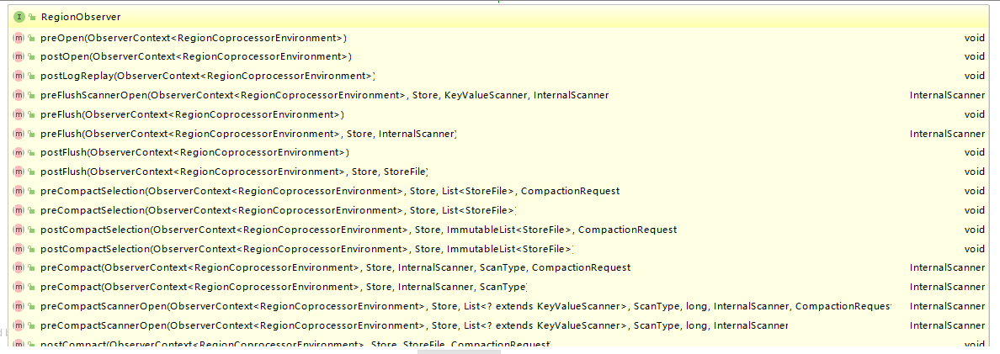
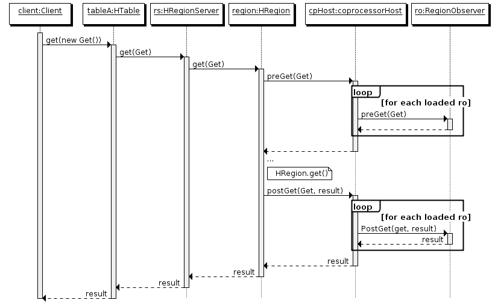
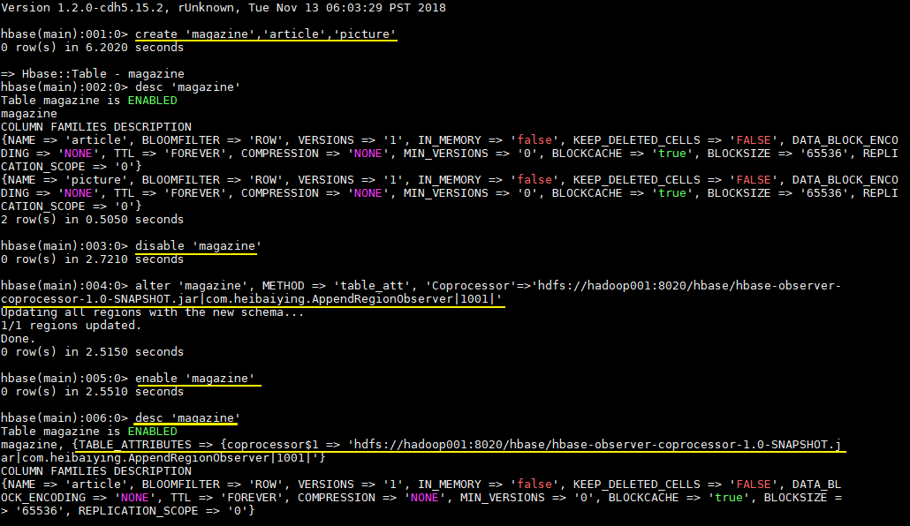
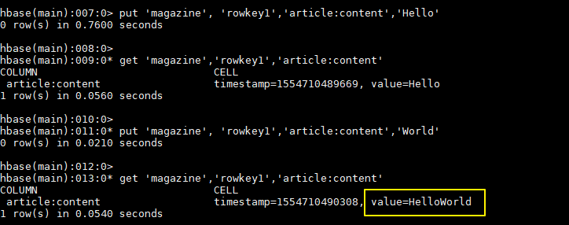
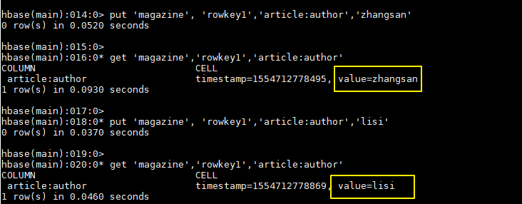
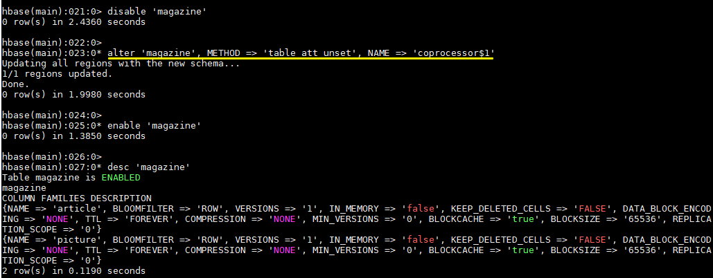

# Hbase 协处理器

<nav>
<a href="#一简述">一、简述</a><br/>
<a href="#二协处理器类型">二、协处理器类型</a><br/>
&nbsp;&nbsp;&nbsp;&nbsp;<a href="#21-Observer协处理器">2.1 Observer协处理器</a><br/>
&nbsp;&nbsp;&nbsp;&nbsp;<a href="#22--Endpoint协处理器">2.2  Endpoint协处理器</a><br/>
<a href="#三协处理的加载方式">三、协处理的加载方式</a><br/>
<a href="#四静态加载与卸载">四、静态加载与卸载</a><br/>
&nbsp;&nbsp;&nbsp;&nbsp;<a href="#41-静态加载">4.1 静态加载</a><br/>
&nbsp;&nbsp;&nbsp;&nbsp;<a href="#42-静态卸载">4.2 静态卸载</a><br/>
<a href="#五动态加载与卸载">五、动态加载与卸载</a><br/>
&nbsp;&nbsp;&nbsp;&nbsp;<a href="#51-HBase-Shell动态加载">5.1 HBase Shell动态加载</a><br/>
&nbsp;&nbsp;&nbsp;&nbsp;<a href="#52-HBase-Shell动态卸载">5.2 HBase Shell动态卸载</a><br/>
&nbsp;&nbsp;&nbsp;&nbsp;<a href="#53-Java-API-动态加载">5.3 Java API 动态加载</a><br/>
&nbsp;&nbsp;&nbsp;&nbsp;<a href="#54-Java-API-动态卸载">5.4 Java API 动态卸载</a><br/>
<a href="#六协处理器案例">六、协处理器案例</a><br/>
</nav>


## 一、简述

在使用 HBase 时，如果你的数据量达到了数十亿行或数百万列，此时能否在查询中返回大量数据将受制于网络的带宽，即便网络状况允许，但是客户端的计算处理也未必能够满足要求。在这种情况下，协处理器（Coprocessors）应运而生。它允许你将业务计算代码放入在 RegionServer 的协处理器中，将处理好的数据再返回给客户端，这可以极大地降低需要传输的数据量，从而获得性能上的提升。同时协处理器也允许用户扩展实现 HBase 目前所不具备的功能，如权限校验、二级索引、完整性约束等。


## 二、协处理器类型

### 2.1 Observer协处理器

#### 1. 功能

Observer 协处理器类似于关系型数据库中的触发器，当发生某些事件的时候这类协处理器会被 Server 端调用。通常可以用来实现下面功能：

+ **权限校验**：在执行 `Get` 或 `Put` 操作之前，您可以使用 `preGet` 或 `prePut` 方法检查权限；
+ **完整性约束**： HBase 不支持关系型数据库中的外键功能，可以通过触发器在插入或者删除数据的时候，对关联的数据进行检查；
+ **二级索引**： 可以使用协处理器来维护二级索引。

</br>

#### 2. 类型

当前 Observer 协处理器有以下四种类型：

+ **RegionObserver** : 
  允许您观察 Region 上的事件，例如 Get 和 Put 操作。
+ **RegionServerObserver** : 
  允许您观察与 RegionServer 操作相关的事件，例如启动，停止或执行合并，提交或回滚。
+ **MasterObserver** : 
  允许您观察与 HBase Master 相关的事件，例如表创建，删除或 schema 修改。
+ **WalObserver** : 
  允许您观察与预写日志（WAL）相关的事件。

</br>

####  3. 接口

以上四种类型的 Observer 协处理器均继承自 `Coprocessor` 接口，这四个接口中分别定义了所有可用的钩子方法，以便在对应方法前后执行特定的操作。通常情况下，我们并不会直接实现上面接口，而是继承其 Base 实现类，Base 实现类只是简单空实现了接口中的方法，这样我们在实现自定义的协处理器时，就不必实现所有方法，只需要重写必要方法即可。


这里以 `RegionObservers ` 为例，其接口类中定义了所有可用的钩子方法，下面截取了部分方法的定义，多数方法都是成对出现的，有 `pre` 就有 `post`：



</br>

#### 4. 执行流程



+ 客户端发出 put 请求
+ 该请求被分派给合适的 RegionServer 和 region
+ coprocessorHost 拦截该请求，然后在该表的每个 RegionObserver 上调用 prePut()
+ 如果没有被 `prePut()` 拦截，该请求继续送到 region，然后进行处理
+ region 产生的结果再次被 CoprocessorHost 拦截，调用 `postPut()`
+ 假如没有 `postPut()` 拦截该响应，最终结果被返回给客户端

如果大家了解 Spring，可以将这种执行方式类比于其 AOP 的执行原理即可，官方文档当中也是这样类比的：

>If you are familiar with Aspect Oriented Programming (AOP), you can think of a coprocessor as applying advice by intercepting a request and then running some custom code,before passing the request on to its final destination (or even changing the destination).
>
>如果您熟悉面向切面编程（AOP），您可以将协处理器视为通过拦截请求然后运行一些自定义代码来使用 Advice，然后将请求传递到其最终目标（或者更改目标）。


### 2.2  Endpoint协处理器

Endpoint 协处理器类似于关系型数据库中的存储过程。客户端可以调用 Endpoint 协处理器在服务端对数据进行处理，然后再返回。

以聚集操作为例，如果没有协处理器，当用户需要找出一张表中的最大数据，即 max 聚合操作，就必须进行全表扫描，然后在客户端上遍历扫描结果，这必然会加重了客户端处理数据的压力。利用 Coprocessor，用户可以将求最大值的代码部署到 HBase Server 端，HBase 将利用底层 cluster 的多个节点并发执行求最大值的操作。即在每个 Region 范围内执行求最大值的代码，将每个 Region 的最大值在 Region Server 端计算出来，仅仅将该 max 值返回给客户端。之后客户端只需要将每个 Region 的最大值进行比较而找到其中最大的值即可。


## 三、协处理的加载方式

要使用我们自己开发的协处理器，必须通过静态（使用 HBase 配置）或动态（使用 HBase Shell 或 Java API）加载它。

+ 静态加载的协处理器称之为 **System Coprocessor**（系统级协处理器）,作用范围是整个 HBase 上的所有表，需要重启 HBase 服务；
+ 动态加载的协处理器称之为 **Table Coprocessor**（表处理器），作用于指定的表，不需要重启 HBase 服务。

其加载和卸载方式分别介绍如下。


## 四、静态加载与卸载

### 4.1 静态加载

静态加载分以下三步：

1. 在 `hbase-site.xml` 定义需要加载的协处理器。

```xml
<property>
    <name>hbase.coprocessor.region.classes</name>
    <value>org.myname.hbase.coprocessor.endpoint.SumEndPoint</value>
</property>
```

 ` <name>` 标签的值必须是下面其中之一：

  + RegionObservers 和 Endpoints 协处理器：`hbase.coprocessor.region.classes` 
  + WALObservers 协处理器： `hbase.coprocessor.wal.classes` 
  + MasterObservers 协处理器：`hbase.coprocessor.master.classes`

  `<value>` 必须是协处理器实现类的全限定类名。如果为加载指定了多个类，则类名必须以逗号分隔。

2. 将 jar(包含代码和所有依赖项) 放入 HBase 安装目录中的 `lib` 目录下；

3. 重启 HBase。

</br>

### 4.2 静态卸载

1. 从 hbase-site.xml 中删除配置的协处理器的\<property>元素及其子元素；

2. 从类路径或 HBase 的 lib 目录中删除协处理器的 JAR 文件（可选）；

3. 重启 HBase。
   


## 五、动态加载与卸载

使用动态加载协处理器，不需要重新启动 HBase。但动态加载的协处理器是基于每个表加载的，只能用于所指定的表。
此外，在使用动态加载必须使表脱机（disable）以加载协处理器。动态加载通常有两种方式：Shell 和 Java API 。 

> 以下示例基于两个前提：
>
> 1. coprocessor.jar 包含协处理器实现及其所有依赖项。
> 2. JAR 包存放在 HDFS 上的路径为：hdfs：// \<namenode>：\<port> / user / \<hadoop-user> /coprocessor.jar

### 5.1 HBase Shell动态加载

1. 使用 HBase Shell 禁用表

```shell
hbase > disable 'tableName'
```

2. 使用如下命令加载协处理器

```shell
hbase > alter 'tableName', METHOD => 'table_att', 'Coprocessor'=>'hdfs://<namenode>:<port>/
user/<hadoop-user>/coprocessor.jar| org.myname.hbase.Coprocessor.RegionObserverExample|1073741823|
arg1=1,arg2=2'
```

`Coprocessor` 包含由管道（|）字符分隔的四个参数，按顺序解释如下：

+ **JAR 包路径**：通常为 JAR 包在 HDFS 上的路径。关于路径以下两点需要注意：
+ 允许使用通配符，例如：`hdfs://<namenode>:<port>/user/<hadoop-user>/*.jar` 来添加指定的 JAR 包；
  
+ 可以使指定目录，例如：`hdfs://<namenode>:<port>/user/<hadoop-user>/` ，这会添加目录中的所有 JAR 包，但不会搜索子目录中的 JAR 包。
  
+ **类名**：协处理器的完整类名。
+ **优先级**：协处理器的优先级，遵循数字的自然序，即值越小优先级越高。可以为空，在这种情况下，将分配默认优先级值。
+ **可选参数** ：传递的协处理器的可选参数。

3. 启用表

```shell
hbase > enable 'tableName'
```

4. 验证协处理器是否已加载

```shell
hbase > describe 'tableName'
```

协处理器出现在 `TABLE_ATTRIBUTES` 属性中则代表加载成功。

</br>

### 5.2 HBase Shell动态卸载

1. 禁用表

 ```shell
hbase> disable 'tableName'
 ```

2. 移除表协处理器

```shell
hbase> alter 'tableName', METHOD => 'table_att_unset', NAME => 'coprocessor$1'
```

3. 启用表

```shell
hbase> enable 'tableName'
```

</br>

### 5.3 Java API 动态加载

```java
TableName tableName = TableName.valueOf("users");
String path = "hdfs://<namenode>:<port>/user/<hadoop-user>/coprocessor.jar";
Configuration conf = HBaseConfiguration.create();
Connection connection = ConnectionFactory.createConnection(conf);
Admin admin = connection.getAdmin();
admin.disableTable(tableName);
HTableDescriptor hTableDescriptor = new HTableDescriptor(tableName);
HColumnDescriptor columnFamily1 = new HColumnDescriptor("personalDet");
columnFamily1.setMaxVersions(3);
hTableDescriptor.addFamily(columnFamily1);
HColumnDescriptor columnFamily2 = new HColumnDescriptor("salaryDet");
columnFamily2.setMaxVersions(3);
hTableDescriptor.addFamily(columnFamily2);
hTableDescriptor.setValue("COPROCESSOR$1", path + "|"
+ RegionObserverExample.class.getCanonicalName() + "|"
+ Coprocessor.PRIORITY_USER);
admin.modifyTable(tableName, hTableDescriptor);
admin.enableTable(tableName);
```

在 HBase 0.96 及其以后版本中，HTableDescriptor 的 addCoprocessor() 方法提供了一种更为简便的加载方法。

```java
TableName tableName = TableName.valueOf("users");
Path path = new Path("hdfs://<namenode>:<port>/user/<hadoop-user>/coprocessor.jar");
Configuration conf = HBaseConfiguration.create();
Connection connection = ConnectionFactory.createConnection(conf);
Admin admin = connection.getAdmin();
admin.disableTable(tableName);
HTableDescriptor hTableDescriptor = new HTableDescriptor(tableName);
HColumnDescriptor columnFamily1 = new HColumnDescriptor("personalDet");
columnFamily1.setMaxVersions(3);
hTableDescriptor.addFamily(columnFamily1);
HColumnDescriptor columnFamily2 = new HColumnDescriptor("salaryDet");
columnFamily2.setMaxVersions(3);
hTableDescriptor.addFamily(columnFamily2);
hTableDescriptor.addCoprocessor(RegionObserverExample.class.getCanonicalName(), path,
Coprocessor.PRIORITY_USER, null);
admin.modifyTable(tableName, hTableDescriptor);
admin.enableTable(tableName);
```


### 5.4 Java API 动态卸载

卸载其实就是重新定义表但不设置协处理器。这会删除所有表上的协处理器。

```java
TableName tableName = TableName.valueOf("users");
String path = "hdfs://<namenode>:<port>/user/<hadoop-user>/coprocessor.jar";
Configuration conf = HBaseConfiguration.create();
Connection connection = ConnectionFactory.createConnection(conf);
Admin admin = connection.getAdmin();
admin.disableTable(tableName);
HTableDescriptor hTableDescriptor = new HTableDescriptor(tableName);
HColumnDescriptor columnFamily1 = new HColumnDescriptor("personalDet");
columnFamily1.setMaxVersions(3);
hTableDescriptor.addFamily(columnFamily1);
HColumnDescriptor columnFamily2 = new HColumnDescriptor("salaryDet");
columnFamily2.setMaxVersions(3);
hTableDescriptor.addFamily(columnFamily2);
admin.modifyTable(tableName, hTableDescriptor);
admin.enableTable(tableName);
```


## 六、协处理器案例

这里给出一个简单的案例，实现一个类似于 Redis 中 `append` 命令的协处理器，当我们对已有列执行 put 操作时候，HBase 默认执行的是 update 操作，这里我们修改为执行 append 操作。

```shell
# redis append 命令示例
redis>  EXISTS mykey
(integer) 0
redis>  APPEND mykey "Hello"
(integer) 5
redis>  APPEND mykey " World"
(integer) 11
redis>  GET mykey 
"Hello World"
```

### 6.1 创建测试表

```shell
# 创建一张杂志表 有文章和图片两个列族
hbase >  create 'magazine','article','picture'
```

### 6.2 协处理器编程

> 完整代码可见本仓库：[hbase-observer-coprocessor](https://github.com/heibaiying/BigData-Notes/tree/master/code/Hbase\hbase-observer-coprocessor)

新建 Maven 工程，导入下面依赖：

```xml
<dependency>
    <groupId>org.apache.hbase</groupId>
    <artifactId>hbase-common</artifactId>
    <version>1.2.0</version>
</dependency>
<dependency>
    <groupId>org.apache.hbase</groupId>
    <artifactId>hbase-server</artifactId>
    <version>1.2.0</version>
</dependency>
```

继承 `BaseRegionObserver` 实现我们自定义的 `RegionObserver`,对相同的 `article:content` 执行 put 命令时，将新插入的内容添加到原有内容的末尾，代码如下：

```java
public class AppendRegionObserver extends BaseRegionObserver {

    private byte[] columnFamily = Bytes.toBytes("article");
    private byte[] qualifier = Bytes.toBytes("content");

    @Override
    public void prePut(ObserverContext<RegionCoprocessorEnvironment> e, Put put, WALEdit edit,
                       Durability durability) throws IOException {
        if (put.has(columnFamily, qualifier)) {
            // 遍历查询结果，获取指定列的原值
            Result rs = e.getEnvironment().getRegion().get(new Get(put.getRow()));
            String oldValue = "";
            for (Cell cell : rs.rawCells())
                if (CellUtil.matchingColumn(cell, columnFamily, qualifier)) {
                    oldValue = Bytes.toString(CellUtil.cloneValue(cell));
                }

            // 获取指定列新插入的值
            List<Cell> cells = put.get(columnFamily, qualifier);
            String newValue = "";
            for (Cell cell : cells) {
                if (CellUtil.matchingColumn(cell, columnFamily, qualifier)) {
                    newValue = Bytes.toString(CellUtil.cloneValue(cell));
                }
            }

            // Append 操作
            put.addColumn(columnFamily, qualifier, Bytes.toBytes(oldValue + newValue));
        }
    }
}
```

### 6.3 打包项目

使用 maven 命令进行打包，打包后的文件名为 `hbase-observer-coprocessor-1.0-SNAPSHOT.jar`

```shell
# mvn clean package
```

### 6.4 上传JAR包到HDFS

```shell
# 上传项目到HDFS上的hbase目录
hadoop fs -put /usr/app/hbase-observer-coprocessor-1.0-SNAPSHOT.jar /hbase
# 查看上传是否成功
hadoop fs -ls /hbase
```


### 6.5 加载协处理器

1. 加载协处理器前需要先禁用表

```shell
hbase >  disable 'magazine'
```
2. 加载协处理器

```shell
hbase >   alter 'magazine', METHOD => 'table_att', 'Coprocessor'=>'hdfs://hadoop001:8020/hbase/hbase-observer-coprocessor-1.0-SNAPSHOT.jar|com.heibaiying.AppendRegionObserver|1001|'
```

3. 启用表

```shell
hbase >  enable 'magazine'
```

4. 查看协处理器是否加载成功

```shell
hbase >  desc 'magazine'
```

协处理器出现在 `TABLE_ATTRIBUTES` 属性中则代表加载成功，如下图：



### 6.6 测试加载结果

插入一组测试数据：

```shell
hbase > put 'magazine', 'rowkey1','article:content','Hello'
hbase > get 'magazine','rowkey1','article:content'
hbase > put 'magazine', 'rowkey1','article:content','World'
hbase > get 'magazine','rowkey1','article:content'
```

可以看到对于指定列的值已经执行了 append 操作：



插入一组对照数据：

```shell
hbase > put 'magazine', 'rowkey1','article:author','zhangsan'
hbase > get 'magazine','rowkey1','article:author'
hbase > put 'magazine', 'rowkey1','article:author','lisi'
hbase > get 'magazine','rowkey1','article:author'
```

可以看到对于正常的列还是执行 update 操作:



### 6.7 卸载协处理器
1. 卸载协处理器前需要先禁用表

```shell
hbase >  disable 'magazine'
```
2. 卸载协处理器

```shell
hbase > alter 'magazine', METHOD => 'table_att_unset', NAME => 'coprocessor$1'
```

3. 启用表

```shell
hbase >  enable 'magazine'
```

4. 查看协处理器是否卸载成功

```shell
hbase >  desc 'magazine'
```



### 6.8 测试卸载结果

依次执行下面命令可以测试卸载是否成功

```shell
hbase > get 'magazine','rowkey1','article:content'
hbase > put 'magazine', 'rowkey1','article:content','Hello'
hbase > get 'magazine','rowkey1','article:content'
```


## 参考资料

1. [Apache HBase Coprocessors](http://hbase.apache.org/book.html#cp)
2. [Apache HBase Coprocessor Introduction](https://blogs.apache.org/hbase/entry/coprocessor_introduction)
3. [HBase 高階知識](https://www.itread01.com/content/1546245908.html)
