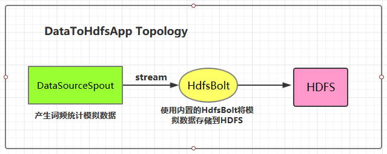
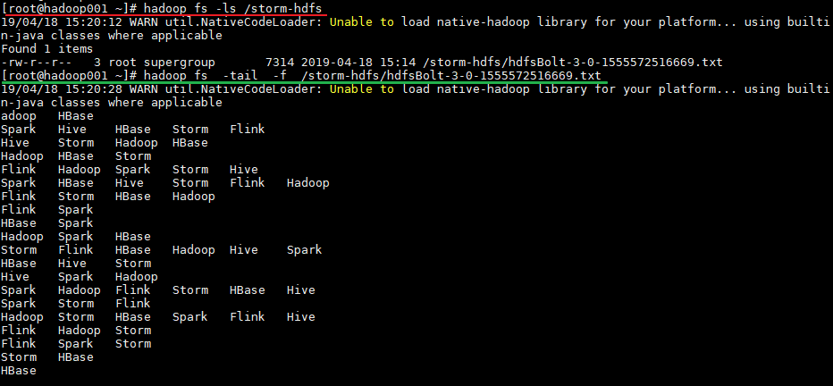

# Storm集成HDFS和HBase

<nav>
<a href="#一Storm集成HDFS">一、Storm集成HDFS</a><br/>
<a href="#二Storm集成HBase">二、Storm集成HBase</a><br/>
</nav>

## 一、Storm集成HDFS

### 1.1 项目结构



> 本用例源码下载地址：[storm-hdfs-integration](https://github.com/heibaiying/BigData-Notes/tree/master/code/Storm/storm-hdfs-integration)

### 1.2 项目主要依赖

项目主要依赖如下，有两个地方需要注意：

+ 这里由于我服务器上安装的是 CDH 版本的 Hadoop，在导入依赖时引入的也是 CDH 版本的依赖，需要使用 `<repository>` 标签指定 CDH 的仓库地址；
+ `hadoop-common`、`hadoop-client`、`hadoop-hdfs` 均需要排除 `slf4j-log4j12` 依赖，原因是 `storm-core` 中已经有该依赖，不排除的话有 JAR 包冲突的风险；

```xml
<properties>
    <storm.version>1.2.2</storm.version>
</properties>

<repositories>
    <repository>
        <id>cloudera</id>
        <url>https://repository.cloudera.com/artifactory/cloudera-repos/</url>
    </repository>
</repositories>

<dependencies>
    <dependency>
        <groupId>org.apache.storm</groupId>
        <artifactId>storm-core</artifactId>
        <version>${storm.version}</version>
    </dependency>
    <!--Storm 整合 HDFS 依赖-->
    <dependency>
        <groupId>org.apache.storm</groupId>
        <artifactId>storm-hdfs</artifactId>
        <version>${storm.version}</version>
    </dependency>
    <dependency>
        <groupId>org.apache.hadoop</groupId>
        <artifactId>hadoop-common</artifactId>
        <version>2.6.0-cdh5.15.2</version>
        <exclusions>
            <exclusion>
                <groupId>org.slf4j</groupId>
                <artifactId>slf4j-log4j12</artifactId>
            </exclusion>
        </exclusions>
    </dependency>
    <dependency>
        <groupId>org.apache.hadoop</groupId>
        <artifactId>hadoop-client</artifactId>
        <version>2.6.0-cdh5.15.2</version>
        <exclusions>
            <exclusion>
                <groupId>org.slf4j</groupId>
                <artifactId>slf4j-log4j12</artifactId>
            </exclusion>
        </exclusions>
    </dependency>
    <dependency>
        <groupId>org.apache.hadoop</groupId>
        <artifactId>hadoop-hdfs</artifactId>
        <version>2.6.0-cdh5.15.2</version>
        <exclusions>
            <exclusion>
                <groupId>org.slf4j</groupId>
                <artifactId>slf4j-log4j12</artifactId>
            </exclusion>
        </exclusions>
    </dependency>
</dependencies>
```

### 1.3 DataSourceSpout

```java
/**
 * 产生词频样本的数据源
 */
public class DataSourceSpout extends BaseRichSpout {

    private List<String> list = Arrays.asList("Spark", "Hadoop", "HBase", "Storm", "Flink", "Hive");

    private SpoutOutputCollector spoutOutputCollector;

    @Override
    public void open(Map map, TopologyContext topologyContext, SpoutOutputCollector spoutOutputCollector) {
        this.spoutOutputCollector = spoutOutputCollector;
    }

    @Override
    public void nextTuple() {
        // 模拟产生数据
        String lineData = productData();
        spoutOutputCollector.emit(new Values(lineData));
        Utils.sleep(1000);
    }

    @Override
    public void declareOutputFields(OutputFieldsDeclarer outputFieldsDeclarer) {
        outputFieldsDeclarer.declare(new Fields("line"));
    }


    /**
     * 模拟数据
     */
    private String productData() {
        Collections.shuffle(list);
        Random random = new Random();
        int endIndex = random.nextInt(list.size()) % (list.size()) + 1;
        return StringUtils.join(list.toArray(), "\t", 0, endIndex);
    }

}
```

产生的模拟数据格式如下：

```properties
Spark	HBase
Hive	Flink	Storm	Hadoop	HBase	Spark
Flink
HBase	Storm
HBase	Hadoop	Hive	Flink
HBase	Flink	Hive	Storm
Hive	Flink	Hadoop
HBase	Hive
Hadoop	Spark	HBase	Storm
```

### 1.4 将数据存储到HDFS

这里 HDFS 的地址和数据存储路径均使用了硬编码，在实际开发中可以通过外部传参指定，这样程序更为灵活。

```java
public class DataToHdfsApp {

    private static final String DATA_SOURCE_SPOUT = "dataSourceSpout";
    private static final String HDFS_BOLT = "hdfsBolt";

    public static void main(String[] args) {

        // 指定 Hadoop 的用户名 如果不指定,则在 HDFS 创建目录时候有可能抛出无权限的异常 (RemoteException: Permission denied)
        System.setProperty("HADOOP_USER_NAME", "root");

        // 定义输出字段 (Field) 之间的分隔符
        RecordFormat format = new DelimitedRecordFormat()
                .withFieldDelimiter("|");

        // 同步策略: 每 100 个 tuples 之后就会把数据从缓存刷新到 HDFS 中
        SyncPolicy syncPolicy = new CountSyncPolicy(100);

        // 文件策略: 每个文件大小上限 1M,超过限定时,创建新文件并继续写入
        FileRotationPolicy rotationPolicy = new FileSizeRotationPolicy(1.0f, Units.MB);

        // 定义存储路径
        FileNameFormat fileNameFormat = new DefaultFileNameFormat()
                .withPath("/storm-hdfs/");

        // 定义 HdfsBolt
        HdfsBolt hdfsBolt = new HdfsBolt()
                .withFsUrl("hdfs://hadoop001:8020")
                .withFileNameFormat(fileNameFormat)
                .withRecordFormat(format)
                .withRotationPolicy(rotationPolicy)
                .withSyncPolicy(syncPolicy);


        // 构建 Topology
        TopologyBuilder builder = new TopologyBuilder();
        builder.setSpout(DATA_SOURCE_SPOUT, new DataSourceSpout());
        // save to HDFS
        builder.setBolt(HDFS_BOLT, hdfsBolt, 1).shuffleGrouping(DATA_SOURCE_SPOUT);


        // 如果外部传参 cluster 则代表线上环境启动,否则代表本地启动
        if (args.length > 0 && args[0].equals("cluster")) {
            try {
                StormSubmitter.submitTopology("ClusterDataToHdfsApp", new Config(), builder.createTopology());
            } catch (AlreadyAliveException | InvalidTopologyException | AuthorizationException e) {
                e.printStackTrace();
            }
        } else {
            LocalCluster cluster = new LocalCluster();
            cluster.submitTopology("LocalDataToHdfsApp",
                    new Config(), builder.createTopology());
        }
    }
}
```

### 1.5 启动测试

可以用直接使用本地模式运行，也可以打包后提交到服务器集群运行。本仓库提供的源码默认采用 `maven-shade-plugin` 进行打包，打包命令如下：

```shell
# mvn clean package -D maven.test.skip=true
```

运行后，数据会存储到 HDFS 的 `/storm-hdfs` 目录下。使用以下命令可以查看目录内容：

```shell
# 查看目录内容
hadoop fs -ls /storm-hdfs
# 监听文内容变化
hadoop fs -tail -f /strom-hdfs/文件名
```





## 二、Storm集成HBase

### 2.1 项目结构

集成用例： 进行词频统计并将最后的结果存储到 HBase，项目主要结构如下：


> 本用例源码下载地址：[storm-hbase-integration](https://github.com/heibaiying/BigData-Notes/tree/master/code/Storm/storm-hbase-integration)

### 2.2 项目主要依赖

```xml
 <properties>
        <storm.version>1.2.2</storm.version>
    </properties>


    <dependencies>
        <dependency>
            <groupId>org.apache.storm</groupId>
            <artifactId>storm-core</artifactId>
            <version>${storm.version}</version>
        </dependency>
        <!--Storm 整合 HBase 依赖-->
        <dependency>
            <groupId>org.apache.storm</groupId>
            <artifactId>storm-hbase</artifactId>
            <version>${storm.version}</version>
        </dependency>
    </dependencies>
```

### 2.3 DataSourceSpout

```java
/**
 * 产生词频样本的数据源
 */
public class DataSourceSpout extends BaseRichSpout {

    private List<String> list = Arrays.asList("Spark", "Hadoop", "HBase", "Storm", "Flink", "Hive");

    private SpoutOutputCollector spoutOutputCollector;

    @Override
    public void open(Map map, TopologyContext topologyContext, SpoutOutputCollector spoutOutputCollector) {
        this.spoutOutputCollector = spoutOutputCollector;
    }

    @Override
    public void nextTuple() {
        // 模拟产生数据
        String lineData = productData();
        spoutOutputCollector.emit(new Values(lineData));
        Utils.sleep(1000);
    }

    @Override
    public void declareOutputFields(OutputFieldsDeclarer outputFieldsDeclarer) {
        outputFieldsDeclarer.declare(new Fields("line"));
    }


    /**
     * 模拟数据
     */
    private String productData() {
        Collections.shuffle(list);
        Random random = new Random();
        int endIndex = random.nextInt(list.size()) % (list.size()) + 1;
        return StringUtils.join(list.toArray(), "\t", 0, endIndex);
    }

}
```

产生的模拟数据格式如下：

```properties
Spark	HBase
Hive	Flink	Storm	Hadoop	HBase	Spark
Flink
HBase	Storm
HBase	Hadoop	Hive	Flink
HBase	Flink	Hive	Storm
Hive	Flink	Hadoop
HBase	Hive
Hadoop	Spark	HBase	Storm
```


### 2.4 SplitBolt

```java
/**
 * 将每行数据按照指定分隔符进行拆分
 */
public class SplitBolt extends BaseRichBolt {

    private OutputCollector collector;

    @Override
    public void prepare(Map stormConf, TopologyContext context, OutputCollector collector) {
        this.collector = collector;
    }

    @Override
    public void execute(Tuple input) {
        String line = input.getStringByField("line");
        String[] words = line.split("\t");
        for (String word : words) {
            collector.emit(tuple(word, 1));
        }
    }

    @Override
    public void declareOutputFields(OutputFieldsDeclarer declarer) {
        declarer.declare(new Fields("word", "count"));
    }
}
```

### 2.5 CountBolt

```java
/**
 * 进行词频统计
 */
public class CountBolt extends BaseRichBolt {

    private Map<String, Integer> counts = new HashMap<>();

    private OutputCollector collector;


    @Override
    public void prepare(Map stormConf, TopologyContext context, OutputCollector collector) {
            this.collector=collector;
    }

    @Override
    public void execute(Tuple input) {
        String word = input.getStringByField("word");
        Integer count = counts.get(word);
        if (count == null) {
            count = 0;
        }
        count++;
        counts.put(word, count);
        // 输出
        collector.emit(new Values(word, String.valueOf(count)));

    }

    @Override
    public void declareOutputFields(OutputFieldsDeclarer declarer) {
        declarer.declare(new Fields("word", "count"));
    }
}
```

### 2.6 WordCountToHBaseApp

```java
/**
 * 进行词频统计 并将统计结果存储到 HBase 中
 */
public class WordCountToHBaseApp {

    private static final String DATA_SOURCE_SPOUT = "dataSourceSpout";
    private static final String SPLIT_BOLT = "splitBolt";
    private static final String COUNT_BOLT = "countBolt";
    private static final String HBASE_BOLT = "hbaseBolt";

    public static void main(String[] args) {

        // storm 的配置
        Config config = new Config();

        // HBase 的配置
        Map<String, Object> hbConf = new HashMap<>();
        hbConf.put("hbase.rootdir", "hdfs://hadoop001:8020/hbase");
        hbConf.put("hbase.zookeeper.quorum", "hadoop001:2181");

        // 将 HBase 的配置传入 Storm 的配置中
        config.put("hbase.conf", hbConf);

        // 定义流数据与 HBase 中数据的映射
        SimpleHBaseMapper mapper = new SimpleHBaseMapper()
                .withRowKeyField("word")
                .withColumnFields(new Fields("word","count"))
                .withColumnFamily("info");

        /*
         * 给 HBaseBolt 传入表名、数据映射关系、和 HBase 的配置信息
         * 表需要预先创建: create 'WordCount','info'
         */
        HBaseBolt hbase = new HBaseBolt("WordCount", mapper)
                .withConfigKey("hbase.conf");

        // 构建 Topology
        TopologyBuilder builder = new TopologyBuilder();
        builder.setSpout(DATA_SOURCE_SPOUT, new DataSourceSpout(),1);
        // split
        builder.setBolt(SPLIT_BOLT, new SplitBolt(), 1).shuffleGrouping(DATA_SOURCE_SPOUT);
        // count
        builder.setBolt(COUNT_BOLT, new CountBolt(),1).shuffleGrouping(SPLIT_BOLT);
        // save to HBase
        builder.setBolt(HBASE_BOLT, hbase, 1).shuffleGrouping(COUNT_BOLT);


        // 如果外部传参 cluster 则代表线上环境启动,否则代表本地启动
        if (args.length > 0 && args[0].equals("cluster")) {
            try {
                StormSubmitter.submitTopology("ClusterWordCountToRedisApp", config, builder.createTopology());
            } catch (AlreadyAliveException | InvalidTopologyException | AuthorizationException e) {
                e.printStackTrace();
            }
        } else {
            LocalCluster cluster = new LocalCluster();
            cluster.submitTopology("LocalWordCountToRedisApp",
                    config, builder.createTopology());
        }
    }
}
```

### 2.7 启动测试

可以用直接使用本地模式运行，也可以打包后提交到服务器集群运行。本仓库提供的源码默认采用 `maven-shade-plugin` 进行打包，打包命令如下：

```shell
# mvn clean package -D maven.test.skip=true
```

运行后，数据会存储到 HBase 的 `WordCount` 表中。使用以下命令查看表的内容：

```shell
hbase >  scan 'WordCount'
```


### 2.8 withCounterFields

在上面的用例中我们是手动编码来实现词频统计，并将最后的结果存储到 HBase 中。其实也可以在构建 `SimpleHBaseMapper` 的时候通过 `withCounterFields` 指定 count 字段，被指定的字段会自动进行累加操作，这样也可以实现词频统计。需要注意的是 withCounterFields 指定的字段必须是 Long 类型，不能是 String 类型。

```java
SimpleHBaseMapper mapper = new SimpleHBaseMapper() 
        .withRowKeyField("word")
        .withColumnFields(new Fields("word"))
        .withCounterFields(new Fields("count"))
        .withColumnFamily("cf");
```


## 参考资料

1. [Apache HDFS Integration](http://storm.apache.org/releases/2.0.0-SNAPSHOT/storm-hdfs.html)
2. [Apache HBase Integration](http://storm.apache.org/releases/2.0.0-SNAPSHOT/storm-hbase.html)
